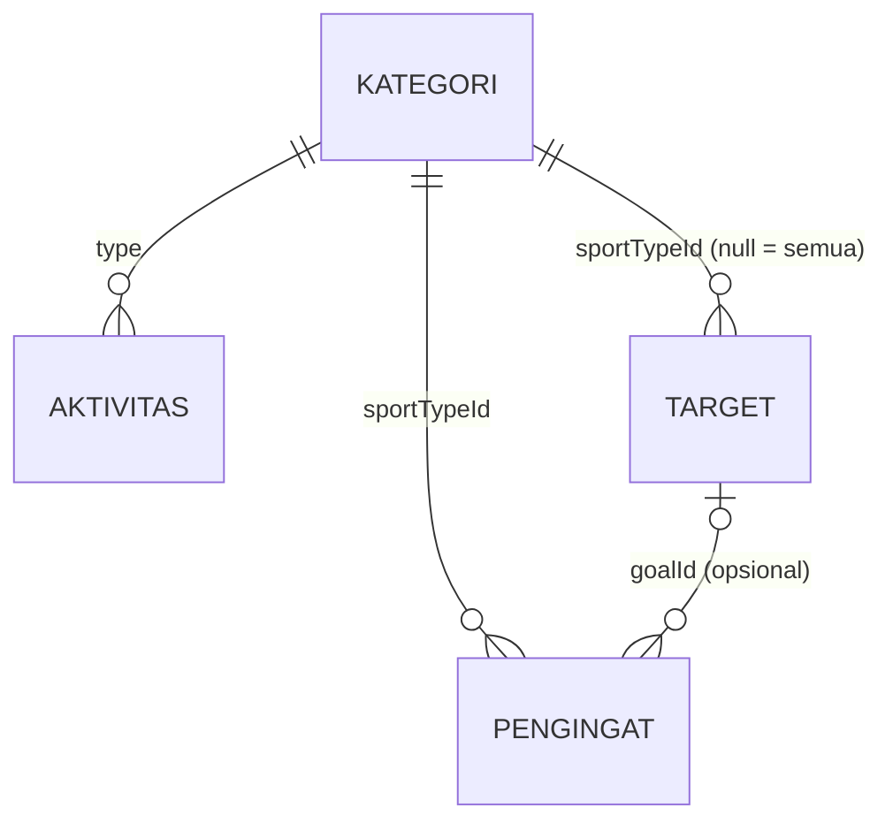

# MoveUp — Persona, Alur Pengguna, dan Cakupan Fitur

MoveUp adalah aplikasi pelacak olahraga yang merekam aktivitas dengan GPS, mencatat aktivitas manual, memantau target latihan, dan menyimpan jadwal pengingat.

## 1. Persona Utama

**Rina Maharani, 27 tahun, staf administrasi di Bandung**

| | |
|---|---|
| Kebiasaan | Lari pagi 2–3 kali seminggu sebelum kerja, sesekali bersepeda atau renang di akhir pekan |
| Perangkat | Ponsel Android kelas menengah, selalu dibawa saat olahraga |
| Tujuan | Konsisten berolahraga, ikut *fun run* 10K dalam tiga bulan, menjaga berat badan |
| Masalah | Sering lupa jadwal latihan, tidak tahu sudah sejauh apa progres mingguannya, catatan latihan tercecer di aplikasi catatan |
| Kebutuhan | Rekam rute dan pace dengan mudah, target mingguan yang jelas, pengingat latihan, riwayat yang rapi |

## 2. Alur Pengguna

### Alur 1: Merekam lari dengan GPS

1. Rina membuka aplikasi. Beranda menampilkan ringkasan minggu ini, target berjalan, dan jadwal berikutnya.
2. Ia menekan tombol **Rekam** di tengah navigasi bawah, lalu memilih jenis olahraga **Lari**.
3. Ia menekan **Mulai**, berlari, lalu memakai tombol jeda dan **Lanjut** bila perlu. Jarak, waktu, dan pace tampil langsung di layar.
4. Ia menekan **Selesai**. Di layar berikutnya, ia mengisi judul dan catatan, lalu menekan **Simpan Aktivitas**.
5. Aplikasi membuka **Detail Aktivitas** yang berisi peta rute, statistik, split per km, dan **Target Terkait** yang ikut bertambah.
6. Dari detail, Rina bisa menekan **Edit** untuk mengubah judul atau jenis olahraga, atau **Hapus** untuk menghapus aktivitas (ada konfirmasi).

### Alur 2: Membuat dan memantau target mingguan

1. Dari **Profil**, Rina membuka **Target (Goal Setting)**, atau menekan **Lihat semua** di bagian Target pada Beranda.
2. Ia menekan **Target Baru**, lalu memilih kategori **Lari**, ukuran **Jarak**, periode **Mingguan**, dan mengisi target **20 km**. Nama target terisi otomatis.
3. Validasi menolak target kosong, bernilai 0, bukan angka, atau melebihi batas wajar. Setelah valid, target tersimpan dan muncul di daftar.
4. Di daftar, Rina memakai filter **Semua / Berjalan / Tercapai**.
5. Ia membuka **Detail Target** untuk melihat persentase, sisa jarak, periode, pengingat terhubung, dan daftar aktivitas yang dihitung.
6. Ia mengubah target lewat **Edit**, atau menghapusnya lewat **Hapus**. Pengingat yang terhubung tetap disimpan, hanya relasinya yang dilepas.

### Alur 3: Mengatur pengingat latihan

1. Dari **Profil**, Rina membuka **Pengaturan Reminder**, atau menekan kartu **Jadwal berikutnya** di Beranda.
2. Ia menekan **Tambah Reminder Baru**, mengisi nama "Lari Pagi", memilih olahraga **Lari**, hari **Sen, Rab, Jum**, jam **05:30**, dan menghubungkannya ke target "Lari 20 km per minggu".
3. Validasi mewajibkan nama minimal 3 karakter dan minimal satu hari.
4. Pengingat muncul di daftar yang terurut menurut jam. Switch di tiap baris mengaktifkan atau menjeda pengingat.
5. Ia mengetuk pengingat untuk mengubahnya, atau menggeser ke kiri untuk menghapus. Penghapusan bisa dibatalkan dengan **Urungkan**.

### Alur 4: Mencatat aktivitas manual

1. Di Beranda, Rina menekan ikon **catatan** di pojok kanan atas.
2. Ia memilih **Renang**, mengatur tanggal dan jam, mengisi durasi dan jarak, lalu menekan **Simpan Aktivitas**.
3. Validasi menolak durasi kosong, menit di atas 59, jarak tidak wajar, dan waktu di masa depan.
4. Aktivitas muncul di Beranda, Riwayat, Statistik, dan progres target yang kategorinya cocok.

## 3. Daftar Layar

| No | Layar | Jenis | File |
|---|---|---|---|
| 1 | Splash, Login, Daftar, Verifikasi Email | Autentikasi | `splash_screen.dart`, `login_screen.dart`, `sign_up_screen.dart`, `verify_email_screen.dart` |
| 2 | Lengkapi Profil | Form | `complete_profile_screen.dart` |
| 3 | Beranda | Ringkasan + daftar | `dashboard_screen.dart` |
| 4 | Riwayat Aktivitas (filter kategori) | Daftar | `history_screen.dart` |
| 5 | Detail Aktivitas | Detail | `activity_detail_screen.dart` |
| 6 | Tambah / Edit Aktivitas | Form | `add_activity_screen.dart` |
| 7 | Rekam GPS | Fungsional | `gps_tracking_screen.dart` |
| 8 | Simpan Aktivitas | Form | `save_activity_screen.dart` |
| 9 | Statistik | Ringkasan | `statistics_screen.dart` |
| 10 | Daftar Target (filter status) | Daftar | `goals_screen.dart` |
| 11 | Detail Target | Detail | `goal_detail_screen.dart` |
| 12 | Tambah / Edit Target | Form | `goal_form_screen.dart` |
| 13 | Daftar Pengingat | Daftar | `reminder_screen.dart` |
| 14 | Tambah / Edit Pengingat | Form | `reminder_form_screen.dart` |
| 15 | Profil | Profil | `profile_screen.dart` |
| 16 | Edit Profil, Keamanan Akun | Form | `edit_profile_screen.dart`, `change_password_screen.dart` |
| 17 | Pengaturan (tema, data, tentang) | Pengaturan | `settings_screen.dart` |

## 4. Modul CRUD dan Relasi Data

| Modul | Create | Read | Update | Delete | Relasi |
|---|---|---|---|---|---|
| Aktivitas | Rekam GPS, input manual | Beranda, Riwayat, Detail | Edit Aktivitas | Hapus + konfirmasi | `type` → Kategori |
| Target | Target Baru | Daftar, Detail + progres | Edit Target | Hapus + konfirmasi, relasi pengingat dilepas | `sportTypeId` → Kategori |
| Pengingat | Reminder Baru | Daftar, jadwal berikutnya | Edit, switch aktif | Geser/Hapus + Urungkan | `sportTypeId` → Kategori, `goalId` → Target |

Data aktivitas, target, dan pengingat disimpan per akun sebagai file JSON di penyimpanan aplikasi (`JsonListStore`). Profil pengguna disimpan di Firestore.

## 5. Data Simulasi

Akun yang baru pertama kali masuk otomatis diisi data simulasi (`lib/services/sample_data.dart`). Tanggalnya dihitung mundur dari hari ini, jadi progres target mingguan dan bulanan langsung terisi. Data ini bisa dimuat ulang atau dihapus dari **Profil → Pengaturan**.

| Data | Jumlah | ID |
|---|---|---|
| Aktivitas (record utama) | 24 | `act-01` … `act-24` |
| Target (record utama) | 6 | `goal-01` … `goal-06` |
| Pengingat (record utama) | 4 | `rem-01` … `rem-04` |
| Kategori olahraga (referensi) | 5 | `run`, `walk`, `ride`, `hike`, `swim` |
| Ukuran target (referensi) | 4 | `distance`, `duration`, `sessions`, `calories` |
| Periode target (referensi) | 2 | `weekly`, `monthly` |
